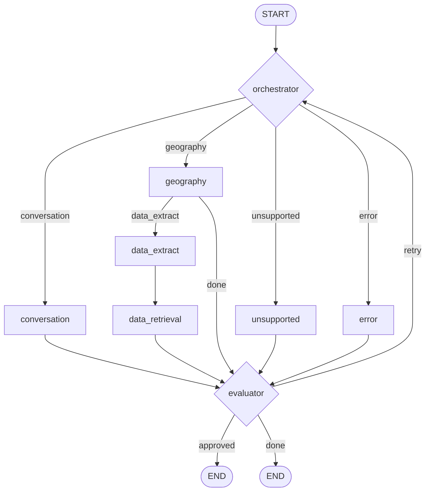

# EOMAS Assistant

Extensible multi-agent starter project for Earth Observability requests, built with:

- LangGraph for orchestration
- Python 3.11+
- Streamlit
- LLM backend via Ollama server / vLLM
- Pydantic validation for agent outputs

### LLM

We currently use the [quantized version](https://huggingface.co/jejwalsh/EVE-Instruct-GGUF) (Q8) of [ESA's EVE LLM](https://eve.philab.esa.int/about) (earth virtual expert), served via the [MEVIS Ollama server](https://www.fme.lan/spaces/GEN/pages/255393883/Ollama+Servers) or via the [vLLM backend](https://www.fme.lan/spaces/GEN/pages/284557894/vLLM+Evaluation).

## Running on the cluster

> [!NOTE]
> The streamlit app is constantly running on nomad:
> **https://eomas-assistant.cloud.intern.mevis.fraunhofer.de/**

If the service/job should be stopped, you can re-start it via the nomad web UI: https://cassiopeia.cloud.intern.mevis.fraunhofer.de/ui/jobs/eomas-assistant@project-eomas

or using the nomad CLI tool:

```powershell
$env:NOMAD_ADDR="https://cassiopeia.cloud.intern.mevis.fraunhofer.de"
$env:NOMAD_TOKEN="..." # has to be refreshed once a week, see https://cassiopeia.cloud.intern.mevis.fraunhofer.de/ui/settings/tokens
nomad run nomad-job.hcl
```

-----------------

## Local execution

### Prerequisites

- Python 3.11+
- `uv` installed
- Ollama/vLLM server reachable from your machine (you have to be in the MEVIS VPN for that)

### Setup

#### 1. Install dependencies:

```powershell
uv sync --all-extras
```

#### 2. Obtain credentials and keys for public STAC API

Visit https://documentation.dataspace.copernicus.eu/APIs/S3.html for instructions on how to obtain access keys for 
copernicus S3. Place the keys in `~/.aws/credentials` (On Windows: `C:\Users\<your_user>\.aws\credentials`) with the following content:

```
[cdse]
aws_access_key_id=<your_access_token>
aws_secret_access_key=<your_access_key>
```

#### 3. Obtain WMTS instance ID

In order to use the [Copernicus WMTS service](https://documentation.dataspace.copernicus.eu/APIs/SentinelHub/OGC/WMTS.html), one has to register at [Copernicus Dashboard](https://shapps.dataspace.copernicus.eu/dashboard) and create a configuration (e.g. using the "Full WMS template") in the "configuration utility". Once created, the instance ID can be found under "service endpoints" (see also [this documentation page](https://dataspace.copernicus.eu/news/2024-2-19-integrating-satellite-imagery-web-applications) and this ). This ID has to go into our .env file:

```env
...
SENTINEL_HUB_INSTANCE_ID=<your_instance_id>
STAC_CACHE_ROOT=cache
...
```

`STAC_CACHE_ROOT` restricts which local files are allowed to be exposed as map overlays.

#### 4. Start TiTiler (required for STAC frame layers on the map)

```bash
uv run python -m uvicorn eomas_assistant.app.titiler_app:app --host 0.0.0.0 --port 8000
```

#### 5. Optional: run TiTiler and Streamlit together in tmux (Linux/macOS)

```bash
cd /home/hlaue/Developer/git/EOMAS/eomas-assistant
uv sync --all-extras
tmux new-session -d -s eomas-local
tmux send-keys -t eomas-local:0.0 'cd /home/hlaue/Developer/git/EOMAS/eomas-assistant && export STAC_CACHE_ROOT=cache && export TITILER_BASE_URL=http://127.0.0.1:8000 && uv run python -m uvicorn eomas_assistant.app.titiler_app:app --host 0.0.0.0 --port 8000' C-m
tmux split-window -h -t eomas-local:0
tmux send-keys -t eomas-local:0.1 'cd /home/hlaue/Developer/git/EOMAS/eomas-assistant && export TITILER_BASE_URL=http://127.0.0.1:8000 && export STAC_CACHE_ROOT=cache && uv run streamlit run src/eomas_assistant/app/streamlit_app.py' C-m
tmux select-layout -t eomas-local:0 even-horizontal
tmux attach -t eomas-local
```

Stop both services:

```bash
tmux kill-session -t eomas-local
```

### Run the App

```powershell
uv run streamlit run src/eomas_assistant/app/streamlit_app.py
```

If `uv` is not installed, run directly from the local virtual environment:

Windows PowerShell:

```powershell
$env:PYTHONPATH='src'; .\.venv\Scripts\python.exe -m streamlit run src/eomas_assistant/app/streamlit_app.py
```

Linux/Unix (bash/zsh):

```bash
PYTHONPATH=src ./.venv/bin/python -m streamlit run src/eomas_assistant/app/streamlit_app.py
```

Open the shown local URL in your browser.

### Run Tests

```powershell
uv run pytest
```

Optional quality checks:

```powershell
uv run ruff check .
uv run mypy src
```

## Architecture Notes


### Workflow Graph

The LangGraph pipeline compiled in `AgentWorkflow._build_graph()` follows this control flow:



The state passed through the graph is centered on the user query plus incremental agent outputs:

- `orchestrator` creates the plan to answer the user request and routes the request to a fitting agent
- `geography` writes the user-facing response and, when successful, the resolved `geo_location`.
- `data_extract` derives a `DataRetrievalRequest` from the original user query.
- `data_download` combines `geo_location` and `data_request`, downloads EO assets, and appends the resulting image metadata to the response.

### Agent Overview

- **Orchestrator** agent: classifies each request into one of the routes `geography`, `unsupported`, or `error`, including a reason and confidence score.
- **Geography** agent: extracts the requested place and time range from the user query, resolves the place via Nominatim, and returns text plus map output. It also enriches state with a resolved `geo_location`, including `bbox_wgs84_lat_lon` and `time_range`.
- **Data** agent: takes the original query together with the resolved geographic context, extracts EO retrieval parameters, and downloads matching EO assets for the derived spatial and temporal window.