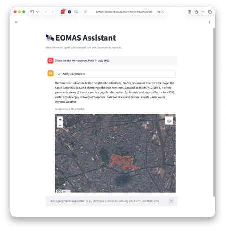

# EOMAS Assistant

This is an extensible agentic chat assistant for Earth Observability requests
which currently supports satellite imagery retrieval and visualization,
extracting the intent from user queries, and orchestrating various tools to
fulfill those requests.  The location is looked up via Nominatim from
OpenStreetMap.  The desired time range can be specified and defaults to the most
recent imagery.  A specific band or index (NDVI) can be specified, default is a
true color image.  By default, cloud-free imagery is preferred (max. 5% cloud
coverage, measured within the target region of interest, *not on the underlying
asset level*).



The Copernicus Data Space Ecosystem (CDSE) is used for imagery-related services:
Cloud cover is checked based on the cloud probability asset if available (recent
imagery) or the scene classification asset (2025 or earlier dates). The WMTS
service is used for map rendering, while the STAC API is used to query assets
that are then downloaded and analyzed locally depending on the user's query.

An screencast of a simple example query just mentioning a location, implying a
request for a recent, cloud-free, true-color image can be found in
[images/simple_screencast.mp4](images/simple_screencast.mp4).

This repository is licensed under the [BSD 3-Clause Clear License](LICENSE).

## Project Background

The EOMAS project was funded by the European Space Agency, through the
"Sprint4EO" project (managed by OHB Digital Services) that spawned a series of
small sprint projects (6 months each) with companies and institutions who were
not yet familiar with earth observation, the goal being to bring cutting edge
technology and ideas from other domains into EO.  EOMAS ended in August 2026,
and this assistant is the final resulting demonstrator.  No major continuation
of this development should be expected at this point.

### Technology Stack

The EOMAS Assistant is built with:

- LangGraph for orchestration
- Python 3.11+
- Streamlit for the prototype UI
- LLM backend via vLLM / Ollama server
- Pydantic validation for LLM outputs
- Rasterio / GDAL for geospatial data processing
- Titiler for serving merged and warped EO imagery (WIP)

### LLM

We currently use the [EVE-Instruct](https://huggingface.co/eve-esa/EVE-Instruct) version of [ESA's EVE LLM](https://eve.philab.esa.int/about) (earth virtual expert, fine-tuned from Mistral-Small-3.2-24B-Instruct-2506), served via a vLLM server hosted in-house (at MEVIS).

We initially used a [quantized version of EVE](https://huggingface.co/jejwalsh/EVE-Instruct-GGUF) (Q8) in GGUF format, served via [Ollama](https://ollama.com/), but that combination did not support tool calls.

Finally, it is also possible to use other LLMs, but note that the behavior varies between models.  For instance, we found that while gpt-5.6-luna often makes better (more consistent) use of the provided tools, the geography extraction is less reliable than with EVE-Instruct with the same prompt (which was developed for EVE).

-----------------

## Local execution

### Prerequisites

- Python 3.11+
- `uv` installed
- LLM service reachable from your machine

### Setup

#### 1. Install dependencies

```powershell
uv sync --all-extras
```

#### 2. Obtain credentials and keys for public STAC API

Visit https://documentation.dataspace.copernicus.eu/APIs/S3.html for instructions on how to obtain access keys for S3 downloads of satellite imagery from the Copernicus Data Space Ecosystem (CDSE).  Set up the environment variables AWS_ACCESS_KEY_ID and AWS_SECRET_ACCESS_KEY in your `.env` file.  (You can use the `.env.example` file as a template.)

#### 3. Obtain WMTS instance ID

In order to use the [Copernicus WMTS service](https://documentation.dataspace.copernicus.eu/APIs/SentinelHub/OGC/WMTS.html), one has to register at [Copernicus Dashboard](https://shapps.dataspace.copernicus.eu/dashboard) and create a configuration (e.g. using the "Full WMS template") in the "configuration utility". Once created, the instance ID can be found under "service endpoints" (see also [the respective CDSE documentation](https://dataspace.copernicus.eu/news/2024-2-19-integrating-satellite-imagery-web-applications)). That ID has to go into our .env file:

```env
...
SENTINEL_HUB_INSTANCE_ID=<your_instance_id>
...
```

<!--
#### 4. Start TiTiler (required for STAC frame layers on the map)

This can be skipped at the moment, since only the WMTS service is currently used for map overlays, see "Limitations" below.

```bash
uv run python -m uvicorn eomas_assistant.app.titiler_app:app --host 0.0.0.0 --port 8000
```
-->

### Run the App

```powershell
uv run streamlit run src/eomas_assistant/app/streamlit_app.py
```

If `uv` is not installed, run directly from the local virtual environment:

Windows PowerShell:

```powershell
$env:PYTHONPATH='src'; .\.venv\Scripts\python.exe -m streamlit run src/eomas_assistant/app/streamlit_app.py
```

Linux/Unix (bash/zsh):

```bash
PYTHONPATH=src ./.venv/bin/python -m streamlit run src/eomas_assistant/app/streamlit_app.py
```

Open the shown local URL in your browser.

### Run Tests

```powershell
uv run pytest
```

Optional quality checks:

```powershell
uv run ruff check .
uv run mypy src
```

## Architecture Notes

We have initially sketched a multi-agent system architecture for EOMAS, which is
shown in the following diagram:


Our current implementation is a simplified version of this architecture, and we
plan to further simplify it towards a single-agent system.  We found that a MAS
is not a good fit for this use case, where we would have to introduce a lot more
communication between the agents in order to organize the responsibilities and
not lose information.

### Workflow Graph

The LangGraph pipeline compiled in `AgentWorkflow._build_graph()` follows this control flow:


### State

The state passed through the graph comprises the user query, message history, and incremental agent outputs:

- The `OrchestratorAgent` creates the `plan` to answer the user request and routes the request to a fitting agent.
- The `GeographyAgent` writes the user-facing response and, when successful, the resolved `geo_location`.
- The `EOImageryAgent` creates a `AssetCatalog` with the STAC information based on the above request analysis.
- Then, it creates a `DataRequest` with the necessary information for the WMTS imagery overlay.
- Several agents may augment the `response` with things (text, map, tabular information for plotting etc.) to be rendered in the UI.
- The `EvaluatorAgent` is responsible for the `evaluation` part of the state, which is used to determine whether the request has been successfully answered or whether it should be re-routed.

## Limitations

### Missing context window management

Ideally, the app would configure/know how big the LLM context window is,
compact/trim message history, and detect when e.g. a tool call result or message
history is too big. As it stands now, depending on the LLM provider, it may cut
off exceeding tokens silently and output quality deteriorates.

### MAS Limitations

As already stated above, we found that a multi-agent system (MAS) is not only
not necessary for this prototype, but in fact counterproductive. The initial MAS
approach causes more LLM calls (higher computational cost, increased latency)
than necessary, without providing benefits in terms of modularity or
maintainability.  As it stands, we would have to introduce a lot more
communication between the agents in order to organize the responsibilities and
not lose information.

### Cache never cleared

The prototype caches downloaded STAC frames in a "cache" directory, but this
cache is never cleared automatically, which may lead to excessive disk usage
over time.  (Just remove the directory manually as you please.)  Files are
touched on use already, so it would not be hard to implement a cache eviction
policy.

### Titiler integration not working

The Titiler integration was an experimental feature that was developed before
the EO imagery agent could actually merge and warp all necessary image frames
for a given user request. As a result of larger code changes, it was temporarily
disabled, although it would not be much work to get running again.  The merged
images would have to be saved to disk before being served by Titiler.  (Note
that `rasterio.merge.merge()` either returns the merged array *or* writes it to
disk, so it would have to be loaded from that file again also for analysis.)
